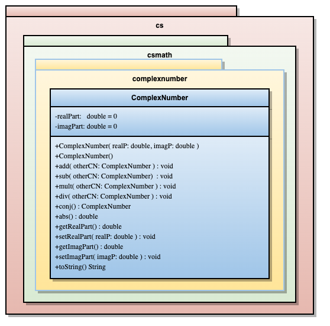

# CSLibrary-Starter-Code
Starter Code for the CSLibrary used in CSCI 261, Data Structures, labs.

## Coding and Testing A Complex Number ADT

### Objectives

At the completion of this lab you should be able to:
*  Create Java packages and libraries
*  Implement the complex number ADT as a Java Class.
*  Create a class by first stubbing-in the methods.
*  Test methods using the IntelliJ debugger.

### Implementing the Complex Number ADT

We will implement the design of the Complex Number shown in Figure 1.

**Part I.** Open the README.md file in the project. Write the definition of ADT and save the file. (See note at the end of this document for more on using Markdown in IntelliJ.)

Definitions of the methods are given in the following table.

| **Operation** | **Description** |
| --- | --- |
| add(otherCN): void | thisCN <- thisCN + otherCN |
| sub(otherCN): void | thisCN <- thisCN – otherCN |
| mult(otherCN): void | thisCN <- thisCN * otherCN |
| div(otherCN): void | thisCN <- thisCN / otherCN |
| conj(): ComplexMumber | returns the conjugate of thisCN |
| abs(): double | returns the magnitude of thisCN |
| ComplexNumber() | construct 0 + 0i |
| ComplexNumber(real, imag) | construct the complex number : real + imagi |
| getRealPart(): double | return the real part of the number |
| getImagPart(): double | return the imaginary part of the number |
| setRealPart(real): void | set the real part of the number to real |
| setImagPart(imag): void | set the imaginary part of the number to imag |
| toString() | ret <- String representation of the number |

**Note** that *ret* indicates the return value of the method. Descriptions of the numeric operations for complex variables may be found on Moodle in the document ComplexNumberADT.pdf.

**Part II.** Do the following steps using the notes found in the document Implementing&TestingComplexNumberADT.pdf as a guide. (Document on Moodle.) Perform these steps in the order listed.
1.  Clone the CSLibrary GitHub repository created for the assignment.
2.  Explore the package structure defined in the repository. Note that all code is in the src folder. The
packages are nested folders inside the src folder as indicated in Figure 1.
3.  Edit the ComplexNumber.java file in the complexnumber package.
4.  Complete the implementation of the stub methods as illustrated in the class diagram and table above:
    *  constructors, the getRealPart method and the getImagPart method.
    *  instance methods add and mult.
    *  instance methods conj and abs.
5. Ensure your code compiles. Test your new class using the IntelliJ debugger. In our next lab we will learn to create and execute test cases with Junit. Here are some values you can use to test your code. You should make up others your self.
    *  (2.0+3.1i)+(3.0–3.1i)=5.0+0i
    *  (3.14 + 2.5i) + (0.0 + 0.0i) = 3.14 + 2.5i
    *  (2.1 + 3.1i) * (0.5 -0.5i) = 2.6 +0.5i
    *  (2.1+3.1i)*(0.0+0.0i)=0.0+0.0i
    *  abs(1.0 + 0.0i) = 1
    *  abs(1.0 + 1.0i) = 1.414 (actually √2)
    *  conj(2.1 + 3.2i) = 2.1 – 3.2i
    *  conj(2.1 -3.2i) = 2.1 + 3.2i

### Finishing Up
Commit your code with the comment "Lab complete" and push to the repository.

1.  Enable Markdown in the IntelliJ Preferences for Editor.

2.  Select Edit Mode to Edit or Preview Mode to See

3.  To add text as a paragraph, type in the editor on a blank line and end the paragraph with a return
followed by a blank line.

### Grading Rubric
#### Lab 3: Coding and Testing a Complex Number ADT

1. The ComplexNumber class should be in the right packages.

   4 points – package is  cs.csmath.complexnumber

   2 point – package partially correct

   0 points – no package

2) Getter and Setters are implemented.

   4 points – the following are implemented.

	     - getRealPart()

              - setRealPart(..)

              - getImagPart()

              - setImagPart(...)              

   2 point  – part of these are implemented.

   0 points – otherwise

3) The constructors are implemented.

   4 points a default constructor that sets the c/n to 0 is implemented and a constructor that takes  a real and an imaginary part is implemented.

    2 point one or the other implemented.

    0 points no constructors implemented

4) Multiply, mult(), is implemented correctly.

   6 points – mult uses a temp variable to save the real part, and implements the correct mult pattern 

   4 points – No temp variable used, but correct pattern followed

   2 point  - real part x real part, imag part x imag part used to generate product

   0 points – mult not implemented.

5) Class includes main method for testing.

   2 point – main method with signature `public static void main(String [] args)` is included and the method contains code that could be used to test one of the methods implemented in the lab.
   
   0 points - no main method
